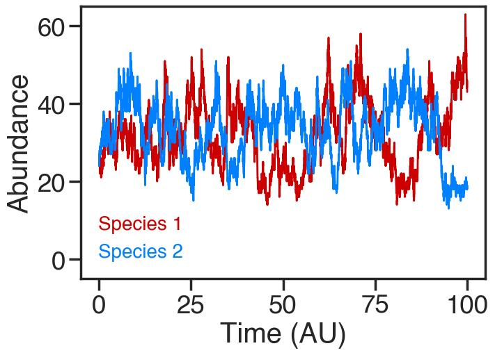
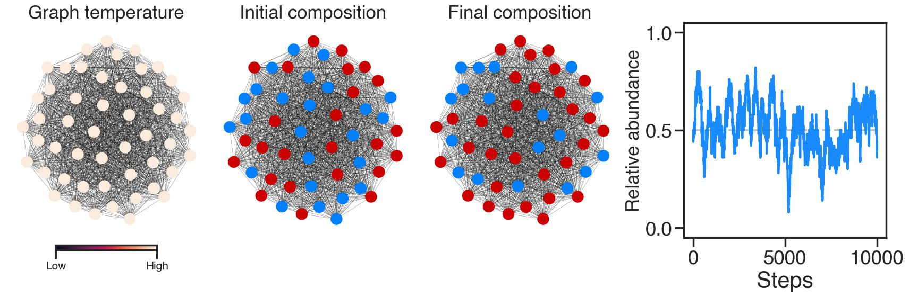
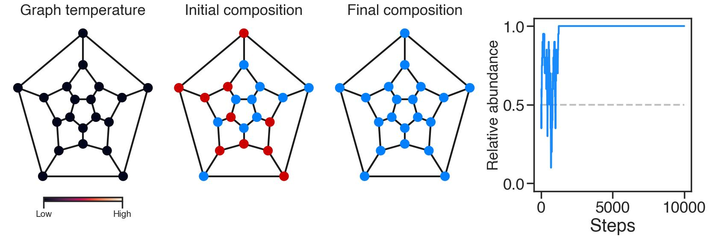
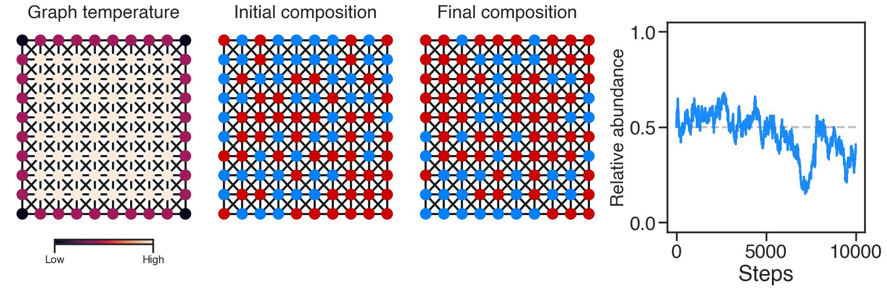

# Ecological Graph Theory (EcoGT)

Understanding the mechanisms behind the coexistence of multiple species in an ecological community -- instead of
competitive exclusion -- remains a central research program in ecology. The competitive
Lotka–Volterra (LV) equations remains the most widely used and analyzed approach to explore the
question of ecological coexistence. The classic LV competition model for two species can be
formulated as

$\frac{dN_1}{dt} = r_1 N_1 (1 - \frac{N_1 + \alpha_{12} N_2}{K_1})$ 

$\frac{dN_2}{dt} = r_2 N_2 (1 - \frac{N_2 + \alpha_{21} N_1}{K_2}) \quad ,$

where $r_i$ is the growth rate of species $i$, $K$ is the carrying capacity, and $\alpha_{ij}$ is
the effect of species $j$ on species $i$. Being deterministic, this version of the LV model lacks
_stochasticity_. We can address this shortcoming by constructing a version of this model as a set of
reactions and simulate the dynamics using Gillespie's stochastic simulation method:

| Reaction  | Description | Propensity function |
| ------------- | ------------- | ------------- |
| $N_1$ -> $N_1$ + 1 | Species 1 birth  | $r_1 N_1 $  |
| $N_1$ -> $N_1$ - 1  | Species 1 death |$r_i N_1(\frac{N_1 + \alpha_{12} N_j}{K_1})$  |

If we simulate this system of reactions, we can see have different combinations of $\alpha_{ij}$
promote or hinder coexistence. For example, $\alpha_{12} < 1$ and $\alpha_{21} < 1$ should result in
coexistence, since each species is more likely to die from intraspecific competition than
interspecific competition: 




> [!TIP]
> To run the stochastic version of the LV model, use 
```ruby
   from stochasticLV import *
   test = SAA(N1, N2, r1, r2, a12, a21, K)
   test.simulate(time)
   output = pd.DataFrame.from_dict(test.init_cond)
```


The stochastic version of the LV model addresses the lack of _stochasticity_, specifically
_demographic stochasticity_, but does not include the effect space on competition.

## From EGT to EcoGT

Evolutionary graph theory (EGT) provides a model to
simulate evolution in a structured population with a finite size. EGT can be considered an extension
of the Moran model. In Moran's model, genotype $g_i$ has a fixed fitness $w_i$. In
each step, an individual is chosen proportional to its fitness and its progeny replaces a randomly
chosen individual, which by chance could be the parent itself. This method of simulation is markedly
different from the Wright-Fisher model, in which the next generation is created in a single sampling
event. 

To recreate the random birth and the density-dependent death in the LV model on a graph, the
population dynamics in EcoGT consists of two steps:

- **Connectivity-based death:** Individual $a$ of species $i$ dies with probability $
\frac{n_i + \alpha_{ij} n_j}{n_t}$, where $n_t$ is the total number of nodes linked in the graph to
individual $a$. This condition results in death events that are a function of local
density. The probability of death is purely a function of the composition of the nodes
connected to the focal node.

- **Birth:** A random individual linked to $a$ reproduces to replace the dead individual.

Competition on a complete graph, where every node is linked to every other node, should resemble a
well-mixed - in the sense of all-to-all interactions - and it does:



In this single simulation of EcoGT on a complete graph with $N=50$ nodes and $\alpha_{12} =
\alpha_{21} = 0.5$. 

> [!NOTE]
> An important concept in EGT is the temperature of node $i$ ($T_i$), defined as the sum of all weights leading to
this node. In an unweighted graph, the temperature  of node $i$ would be identical with its degree,
i.e., $T_i = k_i$, with hot nodes corresponding to nodes with higher degree. In a complete graph --
where all the possible edges between any two nodes are created -- all the nodes have the same
temperature.

The effect of space on ecological competition can be more clearly illustrated using unrealistic
topologies. For example, competition on a **dodecahedron**, with 20 nodes and 30 edges, where each node
is connected to three nodes, results in ecological drift when $\alpha_{12} =
\alpha_{21}$, and, given its size, does not promote coexistence (For simulation below, $\alpha_{12} =
\alpha_{21} = 0.5$):



A **king's graph**, which represents the legal moves of the King piece on a
chessboard, provides another illuminating example. Below is a simulation of species competition on a
king's graph with $\alpha_{12} =
\alpha_{21} = 0.5$:



Although the topologies above can hardly be described as biologically relevant, they
provide pedagogical clarity. 

More realistic topologies can be constructed using some of the most
widely used models to construct network topologies:

<details>

<summary>Erdős–Rényi model
</summary>

### You can add a header

You can add text within a collapsed section.

You can add an image or a code block, too.

```ruby
   puts "Hello World"
```

</details>