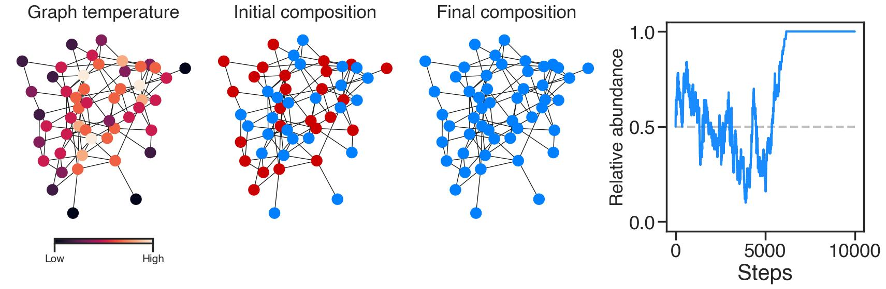
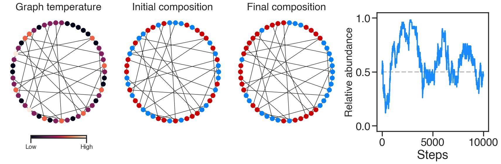
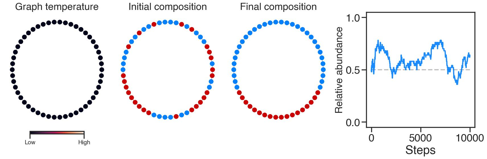
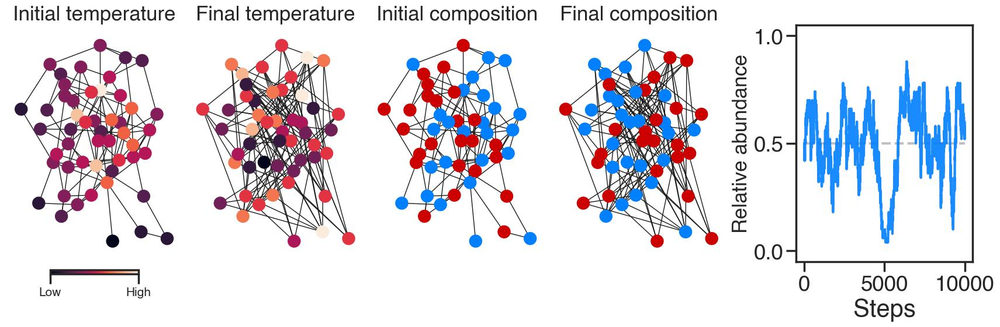
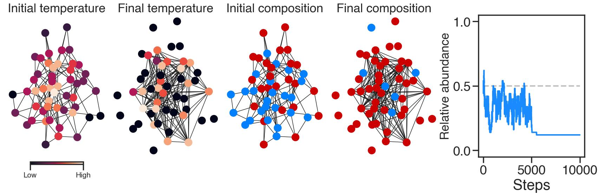
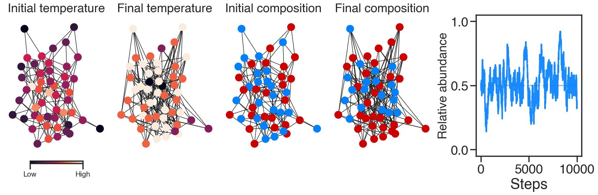
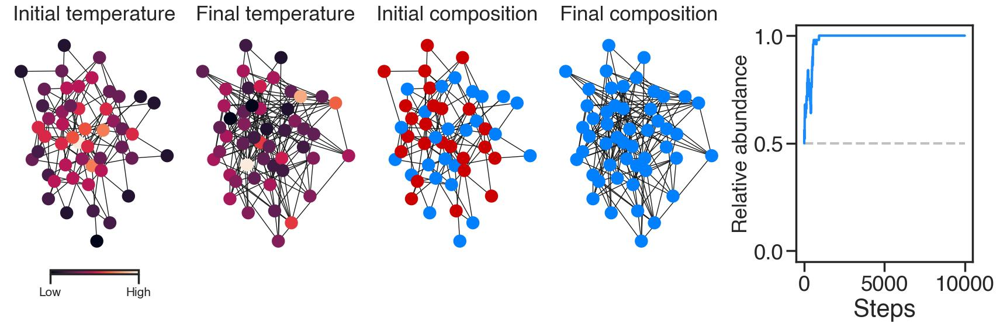
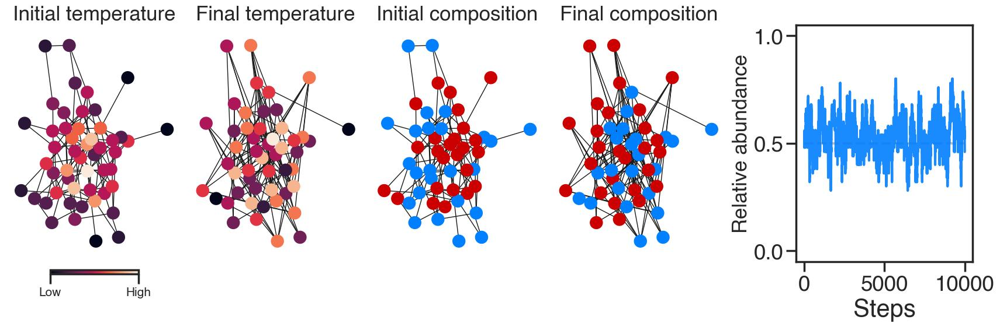

# Ecological Graph Theory (EcoGT)

> [!NOTE]
> The methodology presented here is described in depth in _Ecological graph theory: simulating competition
> and coexistence on graphs_ by Ata Kalirad and Ralf J. Sommer, accepted for publication in **Methods in Ecology and Evolution**. The
> citation and link will be added upon publication.

Understanding the mechanisms behind the coexistence of multiple species in an ecological community -- instead of
competitive exclusion -- remains a central research program in ecology. The competitive
Lotka–Volterra (LV) equations remains the most widely used and analyzed approach to explore the
question of ecological coexistence. The classic LV competition model for two species can be
formulated as

$\frac{dN_1}{dt} = r_1 N_1 (1 - \frac{N_1 + \alpha_{12} N_2}{K_1})$ 

$\frac{dN_2}{dt} = r_2 N_2 (1 - \frac{N_2 + \alpha_{21} N_1}{K_2}) \quad ,$

where $r_i$ is the growth rate of species $i$, $K$ is the carrying capacity, and $\alpha_{ij}$ is
the effect of species $j$ on species $i$. Being deterministic, this version of the LV model lacks
_stochasticity_. We can address this shortcoming by constructing a version of this model as a set of
reactions and simulate the dynamics using Gillespie's stochastic simulation method:

| Reaction  | Description | Propensity function |
| ------------- | ------------- | ------------- |
| $N_1$ -> $N_1$ + 1 | Species 1 birth  | $r_1 N_1 $  |
| $N_1$ -> $N_1$ - 1  | Species 1 death |$r_i N_1(\frac{N_1 + \alpha_{12} N_j}{K_1})$  |

If we simulate this system of reactions, we can see have different combinations of $\alpha_{ij}$
promote or hinder coexistence. For example, $\alpha_{12} < 1$ and $\alpha_{21} < 1$ should result in
coexistence, since each species is more likely to die from intraspecific competition than
interspecific competition: 


> [!IMPORTANT]
> How to run the stochastic version of the LV model?
```ruby
   from stochasticLV import *
   test = SAA(N1_0, N2_0, r1, r2, α12, α21, k)
   test.simulate(time)
   output = pd.DataFrame.from_dict(test.init_cond)
```


The stochastic version of the LV model addresses the lack of _stochasticity_, specifically
_demographic stochasticity_, but does not include the effect space on competition.

## From EGT to EcoGT

Evolutionary graph theory (EGT) provides a model to
simulate evolution in a structured population with a finite size. EGT can be considered an extension
of the Moran model. In Moran's model, genotype $g_i$ has a fixed fitness $w_i$. In
each step, an individual is chosen proportional to its fitness and its progeny replaces a randomly
chosen individual, which by chance could be the parent itself. This method of simulation is markedly
different from the Wright-Fisher model, in which the next generation is created in a single sampling
event. 

To recreate the random birth and the density-dependent death in the LV model on a graph, the
population dynamics in EcoGT consists of two steps:

- **Connectivity-based death:** Individual $a$ of species $i$ dies with probability $
\frac{n_i + \alpha_{ij} n_j}{n_t}$, where $n_t$ is the total number of nodes linked in the graph to
individual $a$. This condition results in death events that are a function of local
density. The probability of death is purely a function of the composition of the nodes
connected to the focal node.

- **Birth:** A random individual linked to $a$ reproduces to replace the dead individual.

Competition on a complete graph, where every node is linked to every other node, should resemble a
well-mixed - in the sense of all-to-all interactions - and it does:


> [!IMPORTANT]
> How to run species competition on a complete graph?
```ruby
   from EcoGT_methods import *
   p0, p1, fB = SC_on_comp_graph(N, t, alpha = {"A":α12, "B":α21})
```


In this single simulation of EcoGT on a complete graph with $N=50$ nodes and $\alpha_{12} =
\alpha_{21} = 0.5$. 

> [!NOTE]
> An important concept in EGT is the temperature of node $i$ ($T_i$), defined as the sum of all weights leading to
this node. In an unweighted graph, the temperature  of node $i$ would be identical with its degree,
i.e., $T_i = k_i$, with hot nodes corresponding to nodes with higher degree. In a complete graph --
where all the possible edges between any two nodes are created -- all the nodes have the same
temperature.


The effect of space on ecological competition can be more clearly illustrated using unrealistic
topologies. For example, competition on a **dodecahedron**, with 20 nodes and 30 edges, where each node
is connected to three nodes, results in ecological drift when $\alpha_{12} =
\alpha_{21}$, and, given its size, does not promote coexistence (For simulation below, $\alpha_{12} =
\alpha_{21} = 0.5$):


> [!IMPORTANT]
> How to run species competition on a dodecahedron?
```ruby
   from EcoGT_methods import *
   p0, p1, fB = SC_on_dodec_graph(t, alpha = {"A":α12, "B":α21})
```


A **king's graph**, which represents the legal moves of the King piece on a
chessboard, provides another illuminating example. Below is a simulation of species competition on a
king's graph with $\alpha_{12} =
\alpha_{21} = 0.5$:


> [!IMPORTANT]
> How to run species competition on a King's graph?
```ruby
   from EcoGT_methods import *
   p0, p1, fB = SC_on_kings_graph(N, p, t, alpha = {"A":α12, "B":α21})
```
> $p$ is the probability of edge creation, with $p=1$ resulting in a king's graph with $N^2$ nodes and
> $4N^2 - 6N + 2$.


Although the topologies above can hardly be described as biologically relevant, they
provide pedagogical clarity. 

More realistic topologies can be constructed using some of the most
widely used models to construct network topologies.

### Erdős–Rényi (ER) model

> [!NOTE]
> Random graphs created using the ER model can be created by either randomly placing $L$ edges
> among $N$ nodes or connecting any two nodes with probability $p$. We use the latter approach here.



> [!IMPORTANT]
> How to run species competition on a random graph?
```ruby
   from EcoGT_methods import *
   p0, p1, fB = SC_on_ER_graph(N, p, t, alpha = {"A":α12, "B":α21})
```
> $p$ is the probability of edge creation.

### Small-world graphs

To generate a graph with small-world properties (networks in which any pair of nodes are rarely connected by a single edge but can nevertheless be reach by
traversing only a handful of edges), we used the model
introduced by Newman and Watts, usually referred to as the Newman–Watts–Strogatz (NWS) model. A NWS graph is specified by three parameters: the number of nodes ($N$),
connected neighbor in a ring topology ($k$), and the probability of new edges connecting a pair of
nodes ($p$). In the classic Watts-Strogatz (WS) model, at first nodes are
connected to $k$ neighbors and then some of these edges are rewired to create shortcuts, whereas in
the NWS model, instead of rewiring existing edges, new edges are added to create shortcuts.
Consequently, the NWS model does not result in disconnected nodes.



> [!IMPORTANT]
> How to run species competition on a small-world graph?
```ruby
   from EcoGT_methods import *
   p0, p1, fB = SC_on_NWSgraph(N, p, k, t, alpha = {"A":α12, "B":α21})
```


### Graphs with ring topology



> [!IMPORTANT]
> How to run species competition on a graph with ring topology?
```ruby
   from EcoGT_methods import *
   p0, p1, fB = SC_on_NWSgraph(N, p=0, k=2, t, alpha = {"A":α12, "B":α21})
```

## The effect of random rewiring on species competition

When considering ecological competition in the wild, many instances would entail the movement of
individuals during the competition, as undirected or directed movements in response to biotic or
abiotic factors in the environment. Thus far, we have only considered competition over topologies
that are fixed at the start of competition, reflecting random placement of individuals of competing
species in space.  We can include the movement of organisms during competition by allowing for the
rewiring of edges during the simulation. 

Given the variety of locomotion in biology, e.g., passive, active, etc., one can conceive a
multitude of ways of implementing edge rewiring in the EcoGT framework.

### Uniform rewiring 
In this method, $m$ edges are randomly rewired at each step. This method approximates passive
locomotion and random walk.



> [!IMPORTANT]
> How to run species competition on a graph with uniform rewiring?
```ruby
   from EcoGT_methods import *
   p0, p1, fB = SC_on_ER_graph_with_UR(N, p, m, t, alpha = {"A":α12, "B":α21})
```
> The staring topology is generated using the ER model with $p$ and $m$ is the number of rewired
> edges per step.

### Rich-gets-richer (RR) rewiring
In this method, inspired by the preferential
attachment, specifically the Barab\'{a}si–Albert model, a new edge is formed between
the randomly chosen node $a$ and node $b$ proportional to $\frac{k_b}{\sum k_j}$, where $k_b$ is the
degree of node $b$ and $\sum k_j$ is the sum of degrees of all the nodes that are not linked to node
$a$. In this method, a node with more links is more likely to receive new links during rewiring. This form of rewiring resembles the formation of biological
clusters such as microbial biofilm.



> [!IMPORTANT]
> How to run species competition on a graph with RR rewiring?
```ruby
   from EcoGT_methods import *
   p0, p1, fB = SC_on_ER_graph_with_PA(N, p, m, t, alpha = {"A":α12, "B":α21},  RR_rewire=True)
```
> The staring topology is generated using the ER model with $p$ and $m$ is the number of rewired
> edges per step.

### Poor-gets-rich (PR) rewiring

A contrast to the RR method, in the PR method, a node
with fewer links is more likely to receive new links during rewiring. Specifically, a new edge is
formed between the randomly chosen node $a$ and node $b$ proportional to $\frac{\Delta_b}{\sum
\Delta_j}$, where $\Delta_b = \mathrm{max}(k_j) - k_b$. This
method approximates scenarios in which species in community are evenly arranged in space. For
example, _Pseudomonas aeruginosa_ cells -- in order to better compete -- evenly disperse in
space to engulf _Agrobacterium tumefaciens_.



> [!IMPORTANT]
> How to run species competition on a graph with PR rewiring?
```ruby
   from EcoGT_methods import *
   p0, p1, fB = SC_on_ER_graph_with_PA(N, p, m, t, alpha = {"A":α12, "B":α21},  RR_rewire=False)
```
> The staring topology is generated using the ER model with $p$ and $m$ is the number of rewired
> edges per step.

### Aggregator rewiring
In this method, rewiring is done such that an individual of
species $i$ is more likely to be linked to a conspecific individual during rewiring, $P{i
\rightarrow i} > P{i\rightarrow j} $.




> [!IMPORTANT]
> How to run species competition on a graph with aggregator rewiring?
```ruby
   from EcoGT_methods import *
   p0, p1, fB = SC_on_ER_graph_agg(N, p, m, t, alpha = {"A":α12, "B":α21}, pref={'A':{'A': 4, 'B': 1}, 'B':{'A': 1, 'B': 4}})
```
> The staring topology is generated using the ER model with $p$ and $m$ is the number of rewired
> edges per step. `pref` dictionary determines the strength of preferential rewiring. 


### Repulsive rewiring

In this method, rewiring is done such that an individual of
species $i$ is more likely to be linked to an individual of species $j$ during rewiring, $P{i
\rightarrow j} > P{i
\rightarrow i} $. This method could be used to simulate reciprocal interactions in
which both species prefer to interact with an allospecific individual, for example symmetrical
intraguild predation, where both species prey on each other.



> [!IMPORTANT]
> How to run species competition on a graph with repulsive rewiring?
```ruby
   from EcoGT_methods import *
   p0, p1, fB = SC_on_ER_graph_agg(N, p, m, t, alpha = {"A":α12, "B":α21}, pref={'A':{'A': 1, 'B': 4}, 'B':{'A': 4, 'B': 1}})
```
> The staring topology is generated using the ER model with $p$ and $m$ is the number of rewired
> edges per step. `pref` dictionary determines the strength of preferential rewiring. 

> [!NOTE]
> Each topology influences the possibility of coexistence for a combination of $\alpha_{12}$ and
> $\alpha_{21}$. We have explored this aspect in depth in the manuscript associated with this repository.


# FAQ

### What libraries do I need to generate the results presented in the paper?

The results presented here and found in the manuscript were generated using the following libraries:
```ruby
Python version : 3.13.3
networkx       : 3.4.2
numpy          : 2.2.5
```